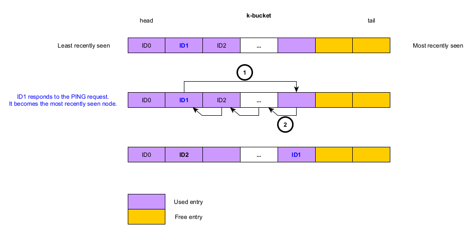
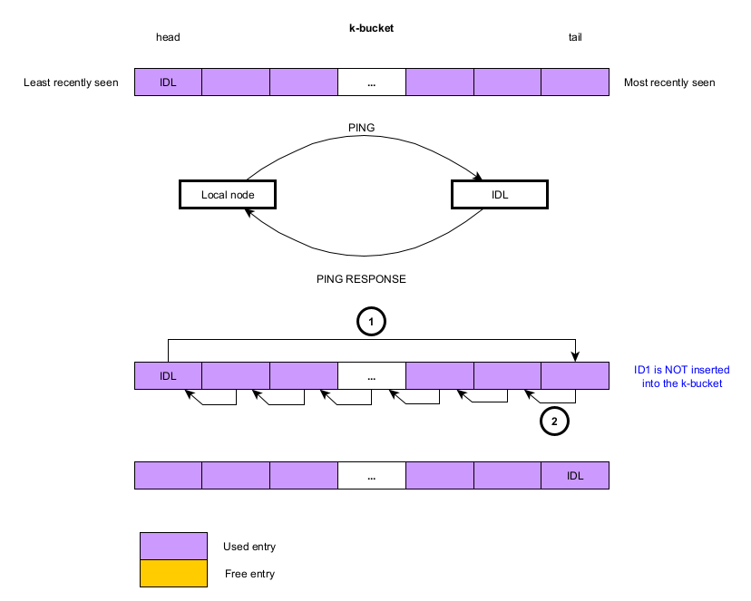

# k-buckets management

The node which ID _ID1_ (we call the node _node1_) is in the _local node_ k-bucket.
The local node receives a message from _node1_.
_ID1_ is moved to the tail of the k-bucket.

The node which ID _ID1_ (we call the node _node1_) is not in the _local node_ k-bucket, and the k-bucket is not full.
_ID1_ is inserted to the tail of the k-bucket.

The node which ID _ID1_ (we call the node _node1_) is not in the _local node_ k-bucket, and the k-bucket is full.
We ping the least recently seen node (located at the head of the k-bucket).
Let _IDL_ be the ID of the least recently seen node.

The _local node_ pings the least recently node.

* If the least responds to the ping, then it is moved to the tail of the k-bucket (since it becomes the most recently
  seen node).
* If the least does not respond to the ping, then it is evicted from the k-bucket and _node1_ is inserted to the tail
  of the k-bucket.
  

