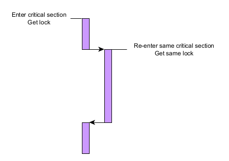

# Threads

In order to allow quick referencing of the elements involved in the synchronization operations,
we apply naming conventions.

Class and methods:

* All thread function names start with the prefix `__thread_`.
* All classes that starts threads implement a method called `__start_theads`.

List of threads: 

* **Class** `message_supervisor.message_supervisor.MessageSupervisor`
  * `message_supervisor.message_supervisor.MessageSupervisor.__thread_cleaner`
* **Class** `node.Node`
  * `node.Node.__thread_listener`
  * `node.Node.__thread_cron`
* **Class** `routing_table.RoutingTable`
  * `routing_table.RoutingTable.__thread_inserter`

List of shared resources:

* All locks have names that begin with `__lock_`.
* All shared variables have names that begin with `__shared_`.

# Using RLock

RLocks (for _re-rentrant_) must be used if the following situation may occur:

